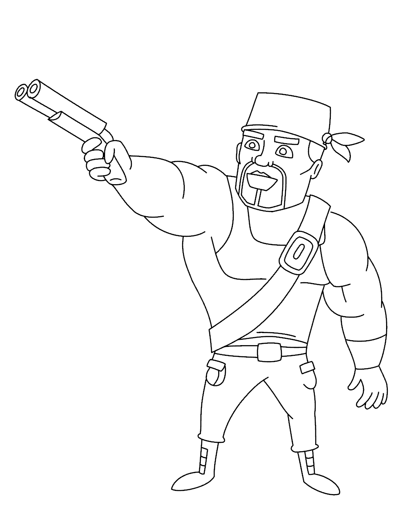
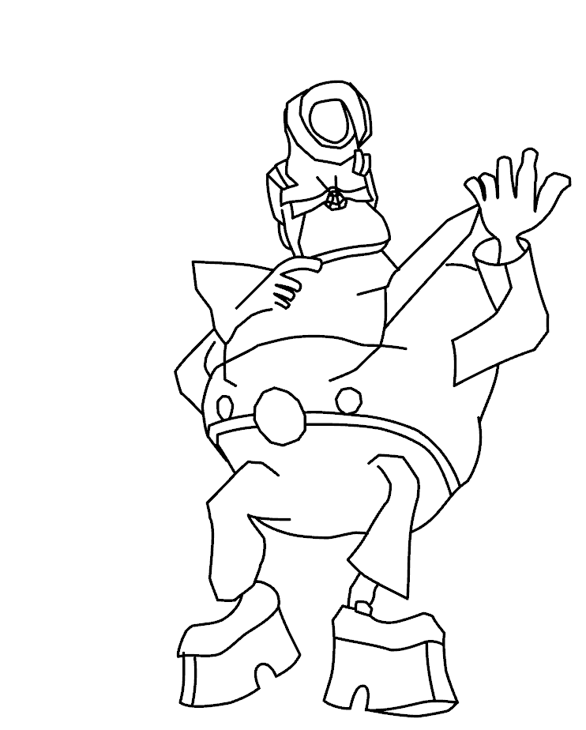

# Awesome-2D-Animation

A collection of tools, datasets and papers about inbetweening and 2D animation.

> Feel free to create a PR or an issue.  (Pull Request is preferred)

 
(The left two examples are from [JoSTC](https://github.com/MarkMoHR/JoSTC) and the right one is from [ToonCrafter](https://github.com/Doubiiu/ToonCrafter))

**Outline**

- [0. Survey](#0-survey)
- [1. Software](#1-software)
- [2. Dataset](#2-dataset)
- [3. Raster-based Animation](#3-raster-based-animation)
- [4. Vector-based Animation](#4-vector-based-animation)
- [5. Differentiable Rendering + Optimization-based Animation](#5-differentiable-rendering--optimization-based-animation)
- [6. LLM/LMM-based Animation](#6-llmlmm-based-animation)
- [7. Interactive Animation Tools](#7-interactive-animation-tools)

---

## 0. Survey

| Paper | Source | Code/Project Link |
| --- | --- | --- |
| [Generative AI for Cel-Animation: A Survey](https://arxiv.org/pdf/2501.06250) | arxiv 25.01 | [[code]](https://github.com/yunlong10/Awesome-AI4Animation) |

## 1. Software

| software | software | software | software |
| --- | --- | --- | --- |
| [Blender](https://www.blender.org/) | [OpenToonz](http://opentoonz.github.io/e/) | [Harmony](https://www.toonboom.com/products/harmony) | [TVPaint](https://www.tvpaint.com/) |
| [Adobe Animate](https://www.adobe.com/products/animate.html) | [Live2D](https://www.live2d.com/en/) | [Cartoon Animator](https://www.reallusion.com/cartoon-animator/) | [CACANi](https://cacani.sg/) |

## 2. Dataset

| Name | Paper | Source | Code/Project Link | 
| --- | --- | --- | --- | 
| [CreativeFlow+](https://www.cs.toronto.edu/creativeflow/) | [Creative Flow+ Dataset](https://www.cs.toronto.edu/creativeflow/files/2596.pdf) | CVPR 2019 | [[code]](https://github.com/creativefloworg/creativeflow) |
| [ATD-12K](https://github.com/lisiyao21/AnimeInterp) | [Deep animation video interpolation in the wild](https://arxiv.org/abs/2104.02495) | CVPR 2021 | [[code]](https://github.com/lisiyao21/AnimeInterp) |
| [AnimeRun](https://lisiyao21.github.io/projects/AnimeRun) | [AnimeRun: 2D Animation Correspondence from Open Source 3D Movies](https://lisiyao21.github.io/projects/AnimeRun) | NeurIPS 2022 | [[code]](https://github.com/lisiyao21/AnimeRun) |
| [AnimeCeleb](https://github.com/kangyeolk/AnimeCeleb) | [AnimeCeleb: Large-Scale Animation CelebHeads Dataset for Head Reenactment](https://arxiv.org/abs/2111.07640) | ECCV 2022 | [[code]](https://github.com/kangyeolk/AnimeCeleb) |
| [Sakuga-42M](https://zhenglinpan.github.io/sakuga_dataset_webpage/) | [Sakuga-42M Dataset: Scaling Up Cartoon Research](https://arxiv.org/abs/2405.07425) | arxiv 24.05 | [[project]](https://zhenglinpan.github.io/sakuga_dataset_webpage/) |
| [Anita](https://github.com/zhenglinpan/AnitaDataset) | [Anita Dataset - An Industrial Animation Dataset](https://zhenglinpan.github.io/AnitaDataset_homepage/) | online 2024 | [[code]](https://github.com/zhenglinpan/AnitaDataset) |

## 3. Raster-based Animation

- Based on template deformation (e.g., ARAP)

| Paper | Source | Code/Project Link |
| --- | --- | --- |
| [As-Rigid-As-Possible Shape Interpolation](https://dl.acm.org/doi/10.1145/344779.344859) | SIGGRAPH 2000 |  |
| [As-Rigid-As-Possible Shape Manipulation](https://dl.acm.org/doi/abs/10.1145/1073204.1073323) | TOG 2005 |  |
| [As-Rigid-As-Possible Image Registration for Hand-drawn Cartoon Animations](https://dl.acm.org/doi/abs/10.1145/1572614.1572619) | NPAR 2009 | [[project]](https://dcgi.fel.cvut.cz/~sykorad/deform.html) |
| [Live Sketch: Video-driven Dynamic Deformation of Static Drawings](http://sweb.cityu.edu.hk/hongbofu/doc/livesketch_CHI2018.pdf) | CHI 2018 | [[video]](https://youtu.be/6DjQR5k286E) |
| [ToonSynth: Example-Based Synthesis of Hand-Colored Cartoon Animations](https://dcgi.fel.cvut.cz/home/sykorad/Dvoroznak18-SIG.pdf) | SIGGRAPH 2018 | [[webpage]](https://dcgi.fel.cvut.cz/home/sykorad/toonsynth.html) |
| [A Method for Animating Children’s Drawings of the Human Figure](https://arxiv.org/abs/2303.12741) | TOG 2023 | [[code]](https://github.com/facebookresearch/AnimatedDrawings) [[project]](https://people.csail.mit.edu/liyifei/publication/children-animated-drawings/) [[demo]](https://sketch.metademolab.com/canvas) |
| [Skeleton-Driven Inbetweening of Bitmap Character Drawings](http://www-labs.iro.umontreal.ca/~bmpix/inbetweening/inbetweening.pdf) | SIGGRAPH Asia 2024 | [[code]](https://github.com/kbrodt/inbetweening) [[webpage]](http://www-labs.iro.umontreal.ca/~bmpix/inbetweening/) |
| [SketchAnim: Real-time sketch animation transfer from videos](https://onlinelibrary.wiley.com/doi/full/10.1111/cgf.15176) | CGF 2024 | [[code]](https://github.com/graphics-research-group/SketchAnim) [[webpage]](https://graphics-research-group.github.io/SketchAnim/) |

- 3D Animation

| Paper | Source | Code/Project Link |
| --- | --- | --- |
| [From Rigging to Waving: 3D-Guided Diffusion for Natural Animation of Hand-Drawn Characters](https://dl.acm.org/doi/abs/10.1145/3763280) | SIGGRAPH Asia 2025 | [[project]](https://lordliang.github.io/From-Rigging-to-Waving/) [[code]](https://github.com/LordLiang/From-Rigging-to-Waving) |
| [DrawingSpinUp: 3D Animation from Single Character Drawings](https://lordliang.github.io/DrawingSpinUp/) | SIGGRAPH Asia 2024 | [[project]](https://lordliang.github.io/DrawingSpinUp/) [[code]](https://github.com/LordLiang/DrawingSpinUp) |
| [Occlusion-robust Stylization for Drawing-based 3D Animation](https://openaccess.thecvf.com/content/ICCV2025/papers/Yoon_Occlusion-robust_Stylization_for_Drawing-based_3D_Animation_ICCV_2025_paper.pdf) | ICCV 2025 | [[project]](https://dbstjswo505.github.io/Drawing-based-3D-Animation-page/) [[code]](https://github.com/dbstjswo505/OSF) |

- Based on frame prediction with network

| Type | Paper | Source | Code/Project Link |
| --- | --- | --- | --- |
| Line art | [Optical Flow Based Line Drawing Frame Interpolation Using Distance Transform to Support Inbetweenings](https://ieeexplore.ieee.org/abstract/document/8803506) | ICIP 2019 |   |
| Line art | [Bridging the Gap: Sketch-Aware Interpolation Network for High-Quality Animation Sketch Inbetweening](https://openreview.net/forum?id=7GPsuT0vyh) | ACM MM 2024 | [[code]](https://github.com/none-master/SAIN) |
| Colorized | [Deep Sketch-Guided Cartoon Video Inbetweening](https://ieeexplore.ieee.org/document/9314221) | TVCG 2021 | [[code]](https://github.com/xiaoyu258/Inbetweening)  |
| Colorized | [Deep Animation Video Interpolation in the Wild](https://openaccess.thecvf.com/content/CVPR2021/papers/Siyao_Deep_Animation_Video_Interpolation_in_the_Wild_CVPR_2021_paper.pdf) | CVPR 2021 | [[code]](https://github.com/lisiyao21/AnimeInterp)  |
| Colorized | [Improving the Perceptual Quality of 2D Animation Interpolation](https://link.springer.com/chapter/10.1007/978-3-031-19790-1_17) | ECCV 2022 | [[code]](https://github.com/ShuhongChen/eisai-anime-interpolator)  |
| Colorized | [CharacterGAN: Few-Shot Keypoint Character Animation and Reposing](https://openaccess.thecvf.com/content/WACV2022/papers/Hinz_CharacterGAN_Few-Shot_Keypoint_Character_Animation_and_Reposing_WACV_2022_paper.pdf) | WACV 2022 |  [[code]](https://github.com/tohinz/CharacterGAN)  |
| Colorized | [ToonCrafter: Generative Cartoon Interpolation](https://arxiv.org/abs/2405.17933) | SIGGRAPH Asia 2024 |  [[code]](https://github.com/ToonCrafter/ToonCrafter) [[webpage]](https://doubiiu.github.io/projects/ToonCrafter/) |
| Sketch | [FlipSketch: Flipping Static Drawings to Text-Guided Sketch Animations](https://arxiv.org/abs/2411.10818) | CVPR 2025 |  [[code]](https://github.com/hmrishavbandy/FlipSketch)  |
| Colorized | [PhysAnimator: Physics-Guided Generative Cartoon Animation](https://arxiv.org/abs/2501.16550) | CVPR 2025 |  [[webpage]](https://xpandora.github.io/PhysAnimator/) |
| Colorized | [AniSora: Exploring the Frontiers of Animation Video Generation in the Sora Era](https://arxiv.org/abs/2412.10255) | IJCAI 2025 |  [[code]](https://github.com/bilibili/Index-anisora) |
| Colorized | [LayerAnimate: Layer-level Control for Animation](https://arxiv.org/abs/2501.08295) | ICCV 2025 |  [[webpage]](https://layeranimate.github.io/) [[code]](https://github.com/IamCreateAI/LayerAnimate) |
| Colorized | [ToonComposer: Streamlining Cartoon Production with Generative Post-Keyframing](https://arxiv.org/abs/2508.10881) | arxiv 25.08 |  [[webpage]](https://lg-li.github.io/project/tooncomposer) [[code]](https://github.com/TencentARC/ToonComposer) |
| Colorized | [FairyGen: Storied Cartoon Video from a Single Child-Drawn Character](https://arxiv.org/abs/2506.21272) | SIGGRAPH Asia 2025 |  [[webpage]](https://jayleejia.github.io/FairyGen/) [[code]](https://github.com/GVCLab/FairyGen) |

## 4. Vector-based Animation

- Based on vertex or stroke correspondence

| Paper | Source | Representation | Code/Project Link |
| --- | --- | --- | --- |
| [Computer Aided Inbetweening](https://dl.acm.org/doi/abs/10.1145/508530.508552) | NPAR 2002 | stroke |  |
| [BetweenIT: An Interactive Tool for Tight Inbetweening](https://onlinelibrary.wiley.com/doi/full/10.1111/j.1467-8659.2009.01630.x) | CGF 2010 | stroke |  |
| [DiLight: Digital light table – Inbetweening for 2D animations using guidelines](https://www.sciencedirect.com/science/article/pii/S0097849317300390) | C&G 2017 | stroke |  |
| [Context-Aware Computer Aided Inbetweening](https://ieeexplore.ieee.org/abstract/document/7831370) | TVCG 2017 | stroke |  |
| [FTP-SC: Fuzzy Topology Preserving Stroke Correspondence](https://dcgi.fel.cvut.cz/home/sykorad/Yang18-SCA.pdf) | SCA 2018 | stroke | [[webpage]](https://dcgi.fel.cvut.cz/home/sykorad/FTP-SC.html) [[video]](https://youtu.be/3oZfCAkYJQk) |
| [Stroke-Based Drawing and Inbetweening with Boundary Strokes](https://onlinelibrary.wiley.com/doi/full/10.1111/cgf.14433) | CGF 2021 | stroke |  |
| [Deep Geometrized Cartoon Line Inbetweening](https://openaccess.thecvf.com/content/ICCV2023/papers/Siyao_Deep_Geometrized_Cartoon_Line_Inbetweening_ICCV_2023_paper.pdf) | ICCV 2023 | vertex/point | [[code]](https://github.com/lisiyao21/AnimeInbet) |
| [Joint Stroke Tracing and Correspondence for 2D Animation](https://dl.acm.org/doi/10.1145/3649890) | TOG 2024 | stroke | [[code]](https://github.com/MarkMoHR/JoSTC) [[webpage]](https://markmohr.github.io/JoSTC/) |
| [Thin-Plate Spline-based Interpolation for Animation Line Inbetweening](https://arxiv.org/abs/2408.09131) | AAAI 2025 | pixel point | [[code]](https://github.com/Tian-one/tps-inbetween) |

- Based on template matching

| Paper | Source | Code/Project Link |
| --- | --- | --- |
| [Non-linear Rough 2D Animation using Transient Embeddings](https://onlinelibrary.wiley.com/doi/full/10.1111/cgf.14771) | CGF 2023 |  |
| [Efficient Interpolation of Rough Line Drawings](https://onlinelibrary.wiley.com/doi/full/10.1111/cgf.14946) | PG 2023 |  |
| [Inbetweening with occlusions for non-linear rough 2D animation](https://www.sciencedirect.com/science/article/pii/S0097849325000640) | C&G 2025 |  |

## 5. Differentiable Rendering + Optimization-based Animation

| Paper | Source | Representation | Code/Project Link |
| --- | --- | --- | --- |
| [Sketch Video Synthesis](https://arxiv.org/abs/2311.15306) | EG 2024 | stroke | [[code]](https://github.com/yudianzheng/SketchVideo) [[project]](https://sketchvideo.github.io/) |
| [Breathing Life Into Sketches Using Text-to-Video Priors](https://arxiv.org/abs/2311.13608) | CVPR 2024 | stroke | [[code]](https://github.com/yael-vinker/live_sketch) [[project]](https://livesketch.github.io/) |
| [AniClipart: Clipart Animation with Text-to-Video Priors](https://arxiv.org/abs/2404.12347) | IJCV 2024 | image/mesh | [[project]](https://aniclipart.github.io/) [[code]](https://github.com/kingnobro/AniClipart) |
| [Dynamic Typography: Bringing Text to Life via Video Diffusion Prior](https://arxiv.org/abs/2404.11614) | ICCV 2025 | curve | [[project]](https://animate-your-word.github.io/demo/) [[code]](https://github.com/zliucz/animate-your-word) |
| [FlexiClip: Locality-Preserving Free-Form Character Animation](https://arxiv.org/abs/2501.08676) | ICML 2025 | image/mesh | [[project]](https://creative-gen.github.io/flexiclip.github.io/) |
| [Multi-Object Sketch Animation by Scene Decomposition and Motion Planning](https://arxiv.org/abs/2503.19351) | ICCV 2025 | stroke | [[webpage]](https://rucmm.github.io/MoSketch/) [[code]](https://github.com/jyliu-98/MoSketch) |
| [Multi-Object Sketch Animation with Grouping and Motion Trajectory Priors](https://arxiv.org/abs/2508.15535) | MM 2025 | stroke | [[webpage]](https://hjc-owo.github.io/GroupSketchProject/) [[code]](https://github.com/Yukinonooo/GroupSketch) |

## 6. LLM/LMM-based Animation

- LMM

| Paper | Source | Code/Project Link |
| --- | --- | --- |
| [Anim-Director: A Large Multimodal Model Powered Agent for Controllable Animation Video Generation](https://dl.acm.org/doi/full/10.1145/3680528.3687688) | SIGGRAPH Asia 2024 | [[code]](https://github.com/HITsz-TMG/Anim-Director) |
| [AniMaker: Multi-Agent Animated Storytelling with MCTS-Driven Clip Generation](https://arxiv.org/abs/2506.10540) | SIGGRAPH Asia 2025 | [[code]](https://github.com/HITsz-TMG/Anim-Director/tree/main/AniMaker)  [[webpage]](https://animaker-dev.github.io/) |

- LLM

| Paper | Source | Representation | Code/Project Link |
| --- | --- | --- | --- |
| [Keyframer: Empowering Animation Design using Large Language Models](https://arxiv.org/abs/2402.06071) | arxiv 24.02 | SVG | [[webpage]](https://machinelearning.apple.com/research/keyframer) |
| [LogoMotion: Visually-Grounded Code Synthesis for Creating and Editing Animation](https://arxiv.org/abs/2405.07065) | CHI 2025 | SVG | [[webpage]](https://vivian-liu.com/#/logomotion) |
| [MoVer: Motion Verification for Motion Graphics Animations](https://arxiv.org/abs/2502.13372) | SIGGRAPH 2025 | SVG | [[webpage]](https://mover-dsl.github.io/) |

## 7. Interactive Animation Tools

| Paper | Source | Code/Project Link |
| --- | --- | --- |
| [Draco: bringing life to illustrations with kinetic textures](https://dl.acm.org/doi/abs/10.1145/2556288.2556987) | CHI 2014 | [[webpage]](https://rubaiathabib.me/2013/12/31/draco/) |
| [Kitty: sketching dynamic and interactive illustrations](https://dl.acm.org/doi/abs/10.1145/2642918.2647375) | UIST 2014 | [[webpage]](https://rubaiathabib.me/2014/07/14/kitty/) |
| [Autocomplete Hand-drawn Animations](https://dl.acm.org/doi/abs/10.1145/2816795.2818079) | SIGGRAPH Asia 2015 | [[webpage]](https://iis-lab.org/research/autocomplete-animations/) [[video]](https://youtu.be/w0YmWiy6sA4) |
| [Motion Amplifiers: Sketching Dynamic Illustrations Using the Principles of 2D Animation](https://dl.acm.org/doi/abs/10.1145/2858036.2858386) | CHI 2016 | [[webpage]](https://rubaiathabib.me/2016/03/25/skuid-sketching-dynamic-illustrations-using-the-principles-of-2d-animation/) |
| [Energy-Brushes: Interactive Tools for Illustrating Stylized Elemental Dynamics](https://dl.acm.org/doi/abs/10.1145/2984511.2984585) | UIST 2016 | [[webpage]](https://rubaiathabib.me/2016/08/16/energy-brushes/) |
| [DrawTalking: Building Interactive Worlds by Sketching and Speaking](https://dl.acm.org/doi/abs/10.1145/3654777.3676334) | UIST 2024 | [[webpage]](https://ktrosenberg.github.io/drawtalking/) |
| [Notational Animating: An Interactive Approach to Creating and Editing Animation Keyframes](https://xinyu-shi.github.io/uploads/Notational_Animating.pdf) | CHI 2026 | [[webpage]](https://xinyu-shi.github.io/uploads/Notational_Animating_project_page/index.html) |

